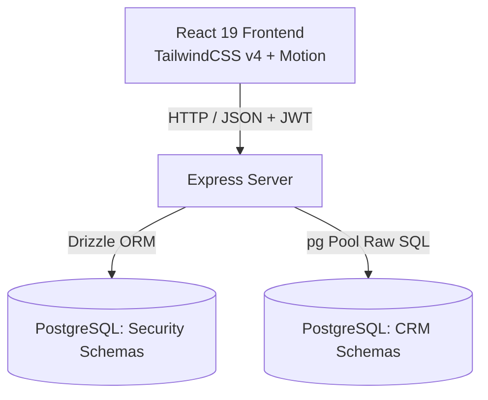
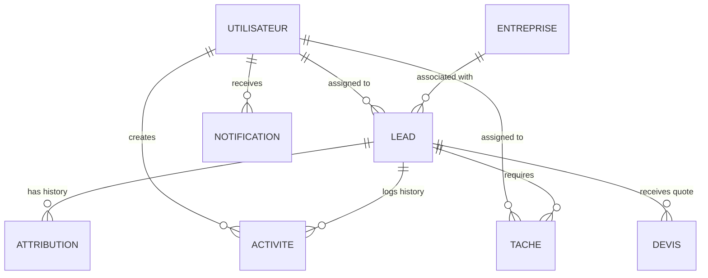
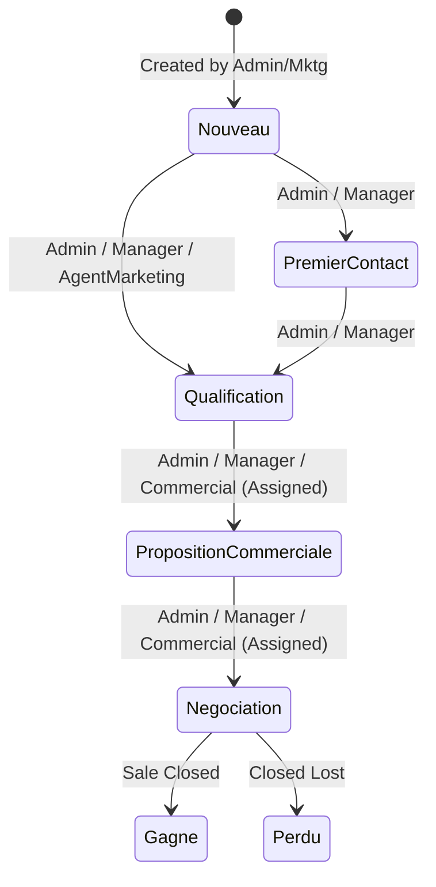

# Lead Tracking System (LeadFlow) - Project Overview

Welcome to the **Lead Tracking System** (internally referenced as **LeadFlow**). This document serves as a central source of truth for understanding the system's architecture, technology stack, database schemas, access control models, core workflows, and local setup.

---

## 1. Executive Summary

LeadFlow is a modern, full-stack CRM (Customer Relationship Management) application designed for managing prospective business leads, logging historical activities, tracking tasks, generating commercial proposals (quotes/devis), and monitoring team KPIs. 

A key focus of the platform is **strict Role-Based Access Control (RBAC)**. The application regulates visibility and actions (such as lead assignments, quote creation, and pipeline progression) dynamically based on the authenticated user's role.

---

## 2. Technology Stack

The project is built on a clean, decoupled architecture:



*   **Frontend Client**: 
    *   **React 19**: Modern component-based rendering.
    *   **TypeScript**: Static typing for interface definitions and API responses.
    *   **TailwindCSS v4**: Next-generation utility-first styling with light/dark theme support.
    *   **Motion**: Dynamic, smooth UI micro-animations.
    *   **Lucide React**: Vector icons for dashboards, states, and sidebars.
*   **Backend Server**: 
    *   **Express**: Lightweight REST API.
    *   **TypeScript / TSX**: Used for server development and runtime compilation (`tsx watch`).
    *   **JWT (JSON Web Tokens)**: Secure token-based session management.
    *   **Bcrypt.js**: Cryptographic password hashing.
*   **Database & Access Layer**:
    *   **PostgreSQL**: Relational database storage.
    *   **Drizzle ORM**: Used exclusively for security elements (the `users` table and security `activity_logs`).
    *   **Node-PostgreSQL (`pg` pool)**: Used for execution of raw SQL queries on CRM business tables.

---

## 3. Database Architecture & Schema Design

The system runs on a PostgreSQL database (`lead_man`) split conceptually into two layers: the **Security/Auth Layer** (managed via Drizzle ORM migrations) and the **Core CRM Layer** (interacted with via repositories and raw SQL).

### 3.1. Security / Auth Layer (Drizzle-Managed)

These tables track system logins, user accounts, and security logs:

#### `users` (Security Accounts)
Represents login accounts for the administrative panel.
*   `id` (serial, Primary Key)
*   `username` (text, unique, not null)
*   `email` (text, unique, not null)
*   `password` (text, hashed, not null)
*   `role` (text, default "user") - *admin, manager, commercial, marketing, user*
*   `status` (text, default "active") - *active, disabled*
*   `created_at` / `updated_at` (timestamp, not null)

#### `activity_logs` (Security & Audit Trail)
Maintains audit logs for security actions.
*   `id` (serial, Primary Key)
*   `user_id` (integer, foreign key referencing `users.id` on cascade delete)
*   `username` (text, not null) - snapshot of user identity
*   `action` (text, not null) - *LOGIN, LOGOUT, REGISTER, UPDATE_USER, DELETE_USER, etc.*
*   `details` (text) - human-readable summary of the action
*   `ip_address` (text)
*   `created_at` (timestamp, not null)

---

### 3.2. Core CRM Layer (SQL-Managed)

These tables host the business-centric entities (in French terminology):



#### `utilisateur` (CRM User profiles)
*   `id` (serial, PK)
*   `nom` (varchar)
*   `prenom` (varchar)
*   `email` (varchar, unique)
*   `mot_de_passe` (varchar, hashed)
*   `role` (varchar) - *Administrateur, Manager, Commercial, AgentMarketing*
*   `actif` (boolean, default true)

#### `entreprise` (Companies)
*   `id` (serial, PK)
*   `nom` (varchar)
*   `secteur` (varchar)
*   `adresse` / `ville` / `pays` (varchar)
*   `telephone` (varchar)
*   `site_web` (varchar)

#### `lead` (Prospective Clients)
*   `id` (serial, PK)
*   `nom` / `prenom` / `telephone` / `email` / `adresse` / `ville` / `pays` (varchar)
*   `source` (varchar) - *SiteWeb, ReseauxSociaux, Recommandation, Emailing, Salon, Telephone*
*   `statut` (varchar) - *Nouveau, PremierContact, Qualification, PropositionCommerciale, Negociation, Gagne, Perdu*
*   `priorite` (varchar) - *Basse, Moyenne, Haute*
*   `score` (integer) - *10 to 95 numeric grade*
*   `valeur_estimee` (numeric)
*   `notes` (text)
*   `entreprise_id` (integer, nullable reference to `entreprise.id`)
*   `commercial_id` (integer, nullable reference to `utilisateur.id`)
*   `date_creation` / `derniere_activite` (timestamp)

#### `attribution` (Lead Assignment Logs)
*   `id` (serial, PK)
*   `date_attribution` (timestamp)
*   `lead_id` (integer references `lead.id`)
*   `commercial_id` (integer references `utilisateur.id`)

#### `activite` (History of Actions)
*   `id` (serial, PK)
*   `type` (varchar) - *Appel, Email, RendezVous, Note, ChangementStatut*
*   `description` (text)
*   `date_activite` (timestamp)
*   `lead_id` (integer references `lead.id`)
*   `utilisateur_id` (integer references `utilisateur.id`)

#### `tache` (Tasks Checklist)
*   `id` (serial, PK)
*   `titre` (varchar)
*   `description` (text)
*   `date_echeance` / `date_creation` (timestamp)
*   `statut` (varchar) - *AFaire, EnCours, Terminee*
*   `lead_id` (integer references `lead.id`)
*   `utilisateur_id` (integer references `utilisateur.id`) - assignee

#### `devis` (Quotes / Proposals)
*   `id` (serial, PK)
*   `reference` (varchar, unique)
*   `montant` (numeric)
*   `statut` (varchar) - *Brouillon, Envoye, Accepte, Refuse*
*   `date_creation` (timestamp)
*   `lead_id` (integer references `lead.id`)

#### `notification` (System In-App Alerts)
*   `id` (serial, PK)
*   `titre` (varchar)
*   `message` (text)
*   `est_lue` (boolean, default false)
*   `date_creation` (timestamp)
*   `utilisateur_id` (integer references `utilisateur.id`)

---

## 4. Role-Based Access Control (RBAC) & Permissions Matrix

The core business logic of LeadFlow dynamically filters queries and restricts commands depending on the user's role. Below is the breakdown of functional permissions.

| Permission / Action | Administrateur | Manager | Commercial | AgentMarketing |
| :--- | :---: | :---: | :---: | :---: |
| **Access Admin Console** | ✅ | ❌ | ❌ | ❌ |
| **Manage Users & Auth Logs** | ✅ | ❌ | ❌ | ❌ |
| **Access KPIs Dashboard** | ✅ | ✅ | ❌ | ❌ |
| **View Leads** | **All Leads** | **All Leads** | **Assigned Only** | **Owned / Unassigned Nouveau** |
| **Create Leads** | ✅ | ✅ | ❌ | ✅ |
| **Modify Lead Details** | ✅ | ✅ | ❌ | ❌ |
| **Delete Leads** | ✅ | ❌ | ❌ | ❌ |
| **Assign Commercials** | ✅ | ✅ | ❌ | ❌ |
| **Advance Pipeline Status** | Standard Flow | Standard Flow | Standard (Assigned) | `Nouveau` ➔ `Qualification` Only |
| **Create / Manage Devis** | ✅ | ✅ | ✅ (Assigned) | ❌ |
| **Manage Tasks** | ✅ | ✅ | ✅ (Assigned/Self) | ❌ |

### Detailed Role Explanations

1.  **Administrateur (Admin)**: Has supreme authority. Can read/write all CRM tables, run raw database seeding scripts, and access security configuration boards to create, edit, suspend, or delete users.
2.  **Manager**: Supersees the sales pipeline. They can review team-wide analytics (won/lost volumes, average values, task completion rates), assign leads to specific commercials, create leads, and transition leads through the entire pipeline.
3.  **Commercial**: The sales agents. They have a narrow view focused exclusively on their allocated accounts. They can log task updates and generate devis (quotes) for their leads, but cannot edit general company metadata or create new leads.
4.  **AgentMarketing**: Responsible for lead ingestion and qualification. They can create new leads, which default to `Nouveau` status. They have visibility over leads they created or leads that are unassigned and in the `Nouveau` stage, and can perform exactly one status progression: transitioning a lead from `Nouveau` to `Qualification`.

---

## 5. Core Business Workflows

### 5.1. Lead Pipeline Flow
The status of a prospective client progresses through the following sequential pipeline:



*   **Standard Progression Validation**: Any status update checks if the transition is in the list of allowed targets for the current state.
*   **AgentMarketing Restrictive Flow**: If the acting role is `AgentMarketing`, they can only transition from `Nouveau` to `Qualification`. Attempting to move a qualified lead to `PropositionCommerciale` returns a `403 Forbidden` error.

### 5.2. Quote Generation (Devis)
*   **Authorization**: Commercials can create proposals for leads assigned to them. Admins and Managers can create proposals for any lead.
*   **Marketing Restriction**: Marketing agents are forbidden from creating proposals (creating one returns `403 Forbidden`).
*   **Audit Logging**: Creating or updating a quote automatically adds a row to `activite` (e.g. *"Devis créé: Réf DEV-2026-0001 (Montant: 12500 €)"*) and updates the lead's `derniere_activite` timestamp.

---

## 6. Backend API Route Directory

All REST endpoints are prefixed with `/api` and require a bearer token in the `Authorization` header (`Bearer <token>`), except the authentication endpoints.

### 6.1. Authentication Routes (`/api/auth`)
*   `POST /login`: Validates password using bcrypt, logs attempt, returns JWT and user profile.
*   `POST /register`: Registers new user profiles with dynamic role mapping.
*   `POST /logout` *(Auth Required)*: Logs standard logout activity in `activity_logs`.
*   `GET /me` *(Auth Required)*: Returns profile payload of the current active session.

### 6.2. User Management Console (`/api/admin`) - *Admin Only*
*   `GET /users`: Retrieves all registered logins.
*   `POST /users`: Directly creates a new user profile.
*   `PUT /users/:id`: Edits email, username, role, or active status (admins cannot demote or disable themselves).
*   `DELETE /users/:id`: Deletes a user profile from the database.
*   `GET /logs`: Fetches the latest 200 system security activity logs.

### 6.3. Business Operations (`/api/...`) - *Auth Required*
*   **Leads (`/api/leads`)**:
    *   `GET /`: Fetches leads visible to the user's role (supports filtering by `source`, `statut`, `priorite`, and global search).
    *   `POST /`: Creates a new lead (allowed for Admin, Manager, Marketing).
    *   `GET /:id`: Retrieves lead details (subject to RBAC filters).
    *   `PUT /:id`: Edits lead details (Admin & Manager only).
    *   `DELETE /:id`: Deletes a lead (Admin only).
    *   `PATCH /:id/status`: Transitions lead status (enforces transition flow validation).
    *   `POST /:id/assign`: Assigns a commercial to the lead (Admin & Manager only).
*   **Enterprises (`/api/entreprises`)**:
    *   `GET /`: List of businesses.
    *   `POST /`: Create an enterprise.
    *   `GET /:id` / `PUT /:id` / `DELETE /:id`: Detailed CRUD.
*   **Tasks (`/api/tasks`)**:
    *   `GET /lead/:leadId`: Fetches tasks for a specific lead.
    *   `POST /`: Creates a task for a lead (assigned to a commercial).
    *   `PUT /:id/status`: Updates task status (*AFaire*, *EnCours*, *Terminee*).
    *   `PUT /:id`: Full task details edit.
*   **Quotes (`/api/devis`)**:
    *   `GET /lead/:leadId`: List of proposals for a lead.
    *   `POST /`: Create a new quote/proposal.
    *   `PATCH /:id/status`: Updates quote status (*Brouillon*, *Envoye*, *Accepte*, *Refuse*).
*   **Notifications (`/api/notifications`)**:
    *   `GET /`: List of user's notifications.
    *   `GET /unread-count`: Number of unread alerts.
    *   `POST /:id/read`: Marks a notification as read.
*   **KPI Analytics (`/api/kpis`)** - *Admin/Manager Only*:
    *   `GET /`: Dashboard aggregates: total counts, total estimated values, won pipeline value, list of overdue tasks, lead breakdown by status/source, and sales performance by commercial.

---

## 7. Setup & Run Instructions

### 7.1. Quick Start Commands

```bash
# 1. Install packages
npm install

# 2. Configure .env file
cp .env.example .env
# Edit details inside .env (SQL Host, Database credentials)

# 3. Create security schemas
npm run db:push

# 4. Seed database tables with mock data
node seed.js

# 5. Launch the application
npm run dev
```

### 7.2. Sandbox Login Credentials (Default Seeding)

Upon running `node seed.js`, the database creates the following default user roles:

*   **Administrator**: `admin@example.com` / `admin123`
*   **Manager**: `manager1@example.com` / `manager123`
*   **Commercial**: `commercial1@example.com` / `commercial123`
*   **Marketing**: `marketing1@example.com` / `marketing123`
